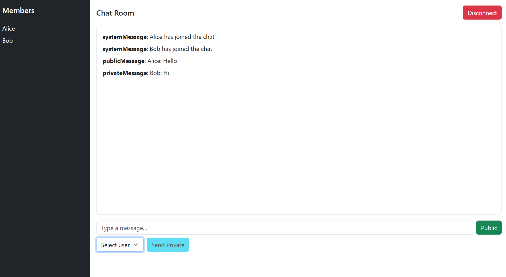

# Chat Client – Real-Time Messaging Web App

This is a simple real-time chat client built as a **practice project for Cloud Computing class**. It allows users to send and receive messages instantly using **WebSockets** and **AWS Lambda**.

The frontend is built with **React** and **Node.js**, and the backend is entirely serverless using **AWS Lambda** and **API Gateway WebSocket API**.

---
s
## Features

- Real-time messaging with WebSockets  
- Serverless backend with AWS Lambda  
- Simple UI to test and learn AWS WebSocket integration

---

## 🛠️ Technologies Used

- **Frontend**: React, Node.js  
- **Backend**: AWS Lambda (Node.js), API Gateway (WebSocket)  
- **Cloud**: AWS (Lambda, API Gateway, IAM roles)

---

## 📸 Demo



---

## Run

### Steps

1. Clone the repository:

   ```bash
   git clone https://github.com/your-username/chat-client.git
   cd chat-client

2. Install frontend dependencies:
    ```bash
    npm install

3. Start the development server:
    ```bash
    npm start
